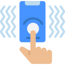
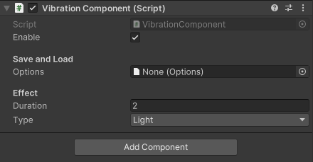

# Vibration/Haptics: Unity Plugin

<h1 align="left">
    
</h1>

>**PS:** This is a fork of original Vibration package **[BenoitFreslon/Vibration](https://github.com/BenoitFreslon/Vibration)** to be published in [openupm](https://openupm.com) registry, while the changes aren't merged into it!

Native **free** plugin for Unity for Android, iOS and [WebGL](https://caniuse.com/webgl2) (with some limitations).
Use custom vibrations/haptics on mobile.

If you like this free plugin, that's be cool if you can buy me a coffee 😀☕️
Send tips to https://paypal.me/UnityVibrationPlugin

## Supported Platforms

-  Android
-  iOS
-  <a href="https://caniuse.com/webgl2"> WebGL </a> (some limitations apply on Mobile)

## Installation

The minimal checked Unity Version is **`2019.3.*`** LTS

Open Package Manager and "Add package from git url..." using next string:

* `https://github.com/BenoitFreslon/Vibration.git#upm`

Or use the latest git release/tag:

* `https://github.com/BenoitFreslon/Vibration.git#0.1.0`

You also can edit `Packages/manifest.json` manually, just add:

* `"com.benoitfreslon.vibration": "https://github.com/BenoitFreslon/Vibration.git#0.1.0",`

Or you can simply copy and paste the entire `[upm]` branch content from this repo, to your Unity3D `Packages/com.benoitfreslon.vibration` folder.

## Getting Started

There are 2 ways of usage this plugin:

1. Use the `Runtime/VibrationComponent.cs` script attached to a _gameObject_ **(Recommended)**

    

    On that script, you can:

    - Enable/Disable vibration from inspector or programatically
        > **TIP:** Useful for enable/disable from a menu settings in your game!
    - Add a `ScriptableObject` asset with vibration settings (only enable/disable for now)
    - Configure the duration and/or select a pre-defined vibration effect type

    This `MonoBehaviour` component use `Runtime/Vibration.cs` static class as a "_fallback_" for some implemented native integrations (**IOS** and **WebGL**)

2. Use the `Runtime/Vibration.cs` static class

    See the scene and a sample `MonoBehaviour` script under folder: `Samples/VibrationExample`

## Vibrations

Using `Runtime/VibrationComponent`

```csharp
// That's the main method to pass a duration (milliseconds)
// and/or a pre-defined `VibrationType` effect
Vibrate(
    milliseconds: 20, 
    vibrationType: VibrationType.Click
);

```

Optionally, you can pass an array of values of **_pattern_** as well:

```csharp
// That's the main method to pass a duration (milliseconds)
// and/or a pre-defined `VibrationType` effect
Vibrate(
    pattern: new[] { 200, 10, 50 }, 
    repeat: VibrationRepeat.Once
);

```

Also, it's possible define the **timeunit** of the duration value:

```csharp
// That's the main method to pass a duration (milliseconds)
// and/or a pre-defined `VibrationType` effect
Vibrate(
    duration: 10, 
    timeUnit: MobileTimeUnit.Seconds
);

```

Check if the mobile device has **vibration support**:

```csharp
// Fallback to "Vibration.HasVibrator()" on iOS and WebGL
HasVibrator();
```

### Android (only)

Check if an Android [VibrationEffect](https://developer.android.com/reference/android/os/VibrationEffect) is supported:

```csharp
// Where: "0" is `VibrationEffect.EFFECT_CLICK` value 
// from native Android Kotlin/Java
IsEffectSupported(0);
```

Check if an Android [VibrationEffect.Composition](https://developer.android.com/reference/android/os/VibrationEffect.Composition) is supported:

```csharp
// Where: "1" is `VibrationEffect.Composition.PRIMITIVE_CLICK` value 
// from native Android Kotlin/Java
IsPrimitiveSupported(1);
```

### iOS and Android

Using `Runtime/Vibration.cs` static class

#### Default vibration

Use `Vibration.Vibrate();` for a classic default ~400ms vibration

#### Pop vibration

Pop vibration: weak boom (For iOS: only available with the haptic engine. iPhone 6s minimum or Android)

`Vibration.VibratePop();`

#### Peek Vibration

Peek vibration: strong boom (For iOS: only available on iOS with the haptic engine. iPhone 6s minimum or Android)

`Vibration.VibratePeek();`

#### Nope Vibration

Nope vibration: series of three weak booms (For iOS: only available with the haptic engine. iPhone 6s minimum or Android)

`Vibration.VibrateNope();`

---

## Android Only

#### Custom duration in milliseconds

`Vibration.Vibrate(500);`

#### Pattern

```csharp
long[] pattern = { 0, 1000, 1000, 1000, 1000 };
Vibration.Vibrate (pattern, -1);
```

#### Cancel

Using `Runtime/VibrationComponent.cs`

```csharp

// Cancel for Android and WebGL
VibrationComponent.Cancel();
```

Using `Runtime/Vibration.cs` static class

```csharp
Vibration.Cancel();
```

---

## IOS only

vibration using haptic engine

`Vibration.VibrateIOS(ImpactFeedbackStyle.Light);`

`Vibration.VibrateIOS(ImpactFeedbackStyle.Medium);`

`Vibration.VibrateIOS(ImpactFeedbackStyle.Heavy);`

`Vibration.VibrateIOS(ImpactFeedbackStyle.Rigid);`

`Vibration.VibrateIOS(ImpactFeedbackStyle.Soft);`

`Vibration.VibrateIOS(NotificationFeedbackStyle.Error);`

`Vibration.VibrateIOS(NotificationFeedbackStyle.Success);`

`Vibration.VibrateIOS(NotificationFeedbackStyle.Warning);`

`Vibration.VibrateIOS_SelectionChanged();`

### References

#### ANDROID

- [Using Vibrate In Android](https://proandroiddev.com/using-vibrate-in-android-b0e3ef5d5e07)
- [Android 12: VibratorManager & New Vibration Primitives](https://yggr.medium.com/exploring-android-12-vibratormanager-new-vibration-primitives-e862c95fe938)
- [Developers Android: VibrationEffect](https://developer.android.com/reference/android/os/VibrationEffect)
- [Developers Android: VibrationEffect.Composition](https://developer.android.com/reference/android/os/VibrationEffect.Composition)

#### ICONS (Copyright)

<a href="https://www.flaticon.com/free-icons/haptic" title="haptic icons">Haptic icons created by Uniconlabs - Flaticon</a>